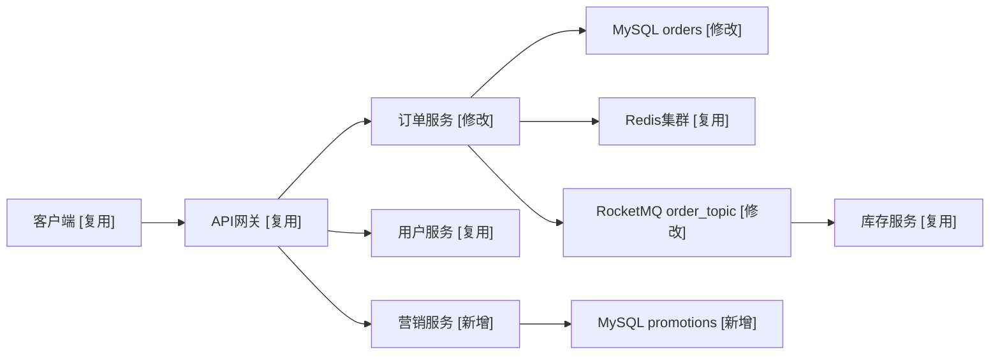

# 第 2 章 整体架构设计 — 撰写规范

## 章节目标

用一张架构图、一份合并后的组件变更清单、一份交互方式说明，让读者 5 分钟看懂"系统长什么样、谁负责什么、谁和谁交互、本次动了哪里"。本章不展开实现细节，只确立"骨架"。

## 必写小节

### 2.1 架构总览

- 必须包含一张 **加上本需求之后的 Mermaid 架构拓扑图**（目标态 / 合入视图），优先使用 `flowchart LR`。
- 图中必须区分：
  - 客户端 / 网关 / 业务服务 / 中间件 / 存储 / 外部依赖
  - 同步调用与异步调用（异步链路在标签中标明队列名）
  - 跨机房 / 跨地域边界（用节点标签或图下说明表达，避免依赖 `subgraph`）
  - 本次变更动作：用文本标记 `[新增]` / `[修改]` / `[复用]`，直接标在模块标签中
- Mermaid 兼容性要求：优先使用 `flowchart LR` 基础语法；节点 ID 只用英文 / 数字 / 下划线；节点标签避免 emoji、HTML 标签、自定义样式、复杂符号、圆柱/双括号节点和过长文本；若节点标签包含 `[新增]` / `[修改]` / `[复用]`，使用 `NodeID["组件名 [新增]"]` 这种带引号写法；跨行说明放在图下文字中。
- 图下配 **3–5 段说明文字**，逐层解释关键路径、变更点和关键影响，不要让读者自己脑补。

**Mermaid 示例**：

> 本图直接表达"加上本需求之后"的目标态架构；同步 / 异步、协议、跨机房边界等细节在图下说明或 §2.3 表格中展开，避免图语法过复杂导致渲染失败。

### 2.2 核心组件与变更清单

字段化表格，**逐组件**列出职责、部署、变更动作和影响面；覆盖 §2.1 架构图中的所有节点，并逐条覆盖本次涉及的服务、模块、存储、MQ topic、缓存 key 命名空间。

| 组件 | 类型 | 变更动作 | 职责（一句话） | 关键 SLA | 上游 | 下游 | 部署形态 | 变更摘要（一句话） | 影响接口 / 字段 / 兼容性 | 对应需求 |
|---|---|---|---|---|---|---|---|---|---|---|
| 订单服务 | 业务服务 | [修改] | 受理订单创建 / 查询 / 取消 | P99≤150ms，可用性 99.95% | 网关 | OrderDB, Redis, MQ | K8s × 6 副本 | 新增"营销叠加结算"分支 | `POST /v1/orders` 入参 `promoIds[]`，向后兼容 | FR-005 |
| 营销服务 | 业务服务 | [新增] | 承载活动定义、领券、核销 | P99≤120ms，可用性 99.95% | 网关, 订单服务 | PromoDB, MQ | K8s × 4 副本 | 新增营销能力承载服务 | 新增 3 个内部 RPC | FR-006 / FR-007 |
| promotions | 存储 | [新增] | 营销主数据持久化 | RPO=0 | 营销服务 | — | MySQL 主从 + 半同步 | 新增营销主数据表 | 详见 §3.1 | FR-006 |
| promo_event | MQ | [新增] | 活动状态广播 | 消息堆积 P99≤5s | 营销服务 | 订单服务, 库存服务 | RocketMQ topic | 新增活动变更事件 | 顺序消息按 promoId | FR-007 |
| 用户服务 | 业务服务 | [复用] | 提供用户基础信息与会员身份 | P99≤100ms，可用性 99.95% | 订单服务 | UserDB | K8s × 6 副本 | 仅作为下游被调，不改造 | — | — |

> 若清单超过 15 行，保留 `[新增]` + `[修改]` 两类全部条目，`[复用]` 未改动条目只列代表性 3–5 条 + 给出"完整复用清单见 `.qiqskills/backend-tech/<方案名>/notes.md`"链接。

**影响面摘要**：
- **新增范围**：列出新增服务、模块、存储、MQ、缓存命名空间。
- **修改范围**：列出被改造的现有服务、接口、表、消息、配置项。
- **复用范围**：列出关键但不改造的现有依赖，说明只读 / 只调用 / 只订阅等复用方式。
- **不改范围**：明确不涉及的核心模块，避免评审误判影响面。

**禁止**：
- 仅画图不列表，读者无法定位每个组件的职责边界和变更动作。
- 将组件职责表与变更清单拆成两张高度重复的表。
- "订单服务负责所有订单相关功能" — 太笼统，无法验收。

### 2.3 组件间交互方式

每条关键交互链路必须说明：

| 字段 | 示例 |
|---|---|
| 调用方 → 被调方 | 订单服务 → 库存服务 |
| 调用方式 | 同步 RPC / 异步 MQ / Webhook |
| 协议 | gRPC（HTTP/2 + protobuf）/ HTTPS+JSON / RocketMQ 顺序消息 |
| 数据格式 | proto 文件路径 / OpenAPI Schema 链接 |
| 超时 | 连接 100ms，整体 500ms |
| 重试 | 最多 2 次，指数退避，仅幂等接口重试 |
| 限流 | 调用方侧 1000 QPS，被调方侧 1500 QPS |
| 熔断 | 错误率 > 30% 触发，半开 30s |
| 鉴权 | 内部 Service Mesh mTLS / OAuth2 / 签名 |

### 2.4 工程一致性原则（已有工程必写；新建工程可省略并显式声明）

若本次需求是在已有工程上演进，必须在本节显式声明：

| 项 | 当前工程约定 | 本次方案是否遵循 | 偏离说明（如有） |
|---|---|---|---|
| 目录结构与分层（如 `controller/service/repo`、Hexagonal、Clean Arch） | | 是 / 否 | |
| 命名规范（包 / 类 / 方法 / DB 表 / 字段 / 错误码前缀） | | 是 / 否 | |
| 错误码体系与异常处理 | | 是 / 否 | |
| 日志格式与字段、监控埋点 SDK | | 是 / 否 | |
| 配置中心 / 限流熔断 / RPC 框架 / ORM 等基础组件选型 | | 是 / 否 | |
| 依赖管理（版本统一、私服）与发布流程 | | 是 / 否 | |

- 偏离项必须在 **第 4 章关键技术决策** 中立卡（候选包含"沿用既有约定"），并给出对比与理由。
- 高内聚低耦合的判定：每个新增 / 修改模块给出"对外暴露的契约"（接口或事件），跨模块调用不走"内部实现细节"。

## Checklist

- [ ] 架构拓扑图可读（不超过 15 个节点；超出则拆分图层）。
- [ ] 同步 / 异步、跨机房边界已在图中或图下说明中显式标注。
- [ ] §2.2 核心组件与变更清单覆盖所有图中节点，且每个组件有明确职责、SLA、变更动作和影响面。
- [ ] 关键交互链路全部明确协议、超时、重试、限流、熔断、鉴权 7 项。
- [ ] §2.1 已给出"加上本需求后的整体架构图（目标态 / 合入视图）"，且用 `[新增]` / `[修改]` / `[复用]` 文本标记区分变更动作。
- [ ] §2.2 逐条覆盖本次涉及的服务、模块、存储、MQ、缓存命名空间，并给出新增 / 修改 / 复用范围摘要。
- [ ] 已有工程：§2.4 工程一致性表已声明并逐项判定；偏离项已在 §4 立卡。
- [ ] 图中术语与全文用词一致（同一对象一个名字，无别名）。
- [ ] 本章未展开实现细节（数据库表结构、接口字段等留到第 3 章）。

## 反模式

- ❌ **大杂烩拓扑图**：把 30 个组件画一张图，读者迷路 — 拆分为"宏观图 + 子模块图"。
- ❌ **只画 happy path**：异常分支不写 — 必须在 §3.3 核心流程与数据流图中体现。
- ❌ **组件名漂移**：图里叫"订单中心"，表里叫"订单服务"，详细设计里叫"order-svc" — 全文统一。
- ❌ **超时 / 重试缺失**：跨服务调用未声明超时 — 默认就会出现"雪崩"风险。
- ❌ **目标态架构缺失**：§2.1 只给"新增组件"局部图、不给加上本需求后的整体架构图，或只描述新增、不列被修改 / 复用的现有组件 — 评审者无法判断系统全貌与影响面。
- ❌ **工程一致性盲区**：在已有工程上引入与既有分层 / 命名 / 错误码冲突的实现却不声明 — 是技术债与维护风险的源头。
