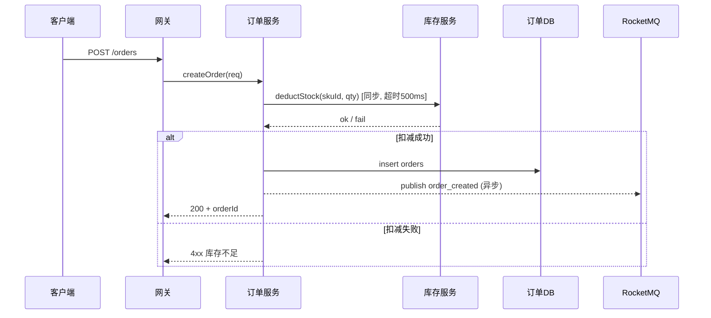

# 第 2 章 整体架构设计 — 撰写规范

## 章节目标

用一张架构图、一份组件清单、一份数据流图，让读者 5 分钟看懂"系统长什么样、谁负责什么、数据怎么流"。本章不展开实现细节，只确立"骨架"。

## 必写小节

### 2.1 架构总览

- 必须包含一张 **Mermaid 架构拓扑图**，优先使用 `flowchart LR`。
- 图中必须区分：
  - 客户端 / 网关 / 业务服务 / 中间件 / 存储 / 外部依赖
  - 同步调用（实线）与异步调用（虚线 + 队列名）
  - 跨机房 / 跨地域边界（用 `subgraph` 表达）
- Mermaid 兼容性要求：节点 ID 只用英文 / 数字 / 下划线；节点标签避免 emoji、HTML 标签、自定义样式、复杂符号和过长文本；跨行说明放在图下文字中。
- 图下配 **3–5 段说明文字**，逐层解释关键路径，不要让读者自己脑补。

**Mermaid 示例**：

```mermaid
flowchart LR
    Client[客户端] --> Gateway[API 网关]
    Gateway -->|HTTPS| OrderSvc[订单服务]
    Gateway -->|HTTPS| UserSvc[用户服务]
    OrderSvc -->|读写| OrderDB[(MySQL: orders)]
    OrderSvc -->|缓存| Redis[(Redis 集群)]
    OrderSvc -.异步.->|订单事件| MQ[[RocketMQ: order_topic]]
    MQ -.->|消费| InventorySvc[库存服务]
    InventorySvc -->|读写| InvDB[(MySQL: inventory)]
```

### 2.2 核心组件清单及职责说明

字段化表格，**逐组件**列出：

| 组件 | 类型 | 职责（一句话） | 关键 SLA | 上游 | 下游 | 部署形态 |
|---|---|---|---|---|---|---|
| 订单服务 | 业务服务 | 受理订单创建/查询/取消 | P99≤150ms，可用性 99.95% | 网关 | OrderDB, Redis, MQ | K8s × 6 副本 |
| 订单 DB | 存储 | 订单主数据持久化 | RPO=0 | 订单服务 | — | MySQL 主从 + 半同步 |

**禁止**：
- 仅画图不列表，读者无法定位每个组件的职责边界。
- "订单服务负责所有订单相关功能" — 太笼统，无法验收。

### 2.3 组件间交互方式

每条关键交互链路必须说明：

| 字段 | 示例 |
|---|---|
| 调用方 → 被调方 | 订单服务 → 库存服务 |
| 调用方式 | 同步 RPC / 异步 MQ / Webhook |
| 协议 | gRPC（HTTP/2 + protobuf）/ HTTPS+JSON / RocketMQ 顺序消息 |
| 数据格式 | proto 文件路径 / OpenAPI Schema 链接 |
| 超时 | 连接 100ms，整体 500ms |
| 重试 | 最多 2 次，指数退避，仅幂等接口重试 |
| 限流 | 调用方侧 1000 QPS，被调方侧 1500 QPS |
| 熔断 | 错误率 > 30% 触发，半开 30s |
| 鉴权 | 内部 Service Mesh mTLS / OAuth2 / 签名 |

### 2.4 数据流图（关键业务场景）

至少为 **每个 P0 级 FR** 画一张数据流图（可用 Mermaid `sequenceDiagram`）。

**Mermaid 时序图示例**：



每张图配文字说明：
- 这个流程对应哪些 FR / NFR。
- 关键决策点（如同步还是异步、强一致还是最终一致）的理由。
- 异常分支（已在图中体现）。

### 2.5 合入视图与变更清单

> 让评审者一眼看清"加上本需求之后系统长什么样、本次到底动了哪里"。

#### 2.5.1 合入后整体架构图

- 必须给出 **加上本需求后** 的整体架构图（即"目标态"），与 §2.1 相同绘制规范。
- 在图中用文本标记区分：`[新增]` / `[修改]` / `[复用]`；不要使用 emoji、HTML 标签或自定义样式，避免 Mermaid 渲染失败。
- 若本次改造范围较大，可在图下追加一张 **变更前 → 变更后对比简图**（≤ 10 节点）。

```mermaid
flowchart LR
    Client[客户端] --> Gateway[API网关]
    Gateway -->|HTTPS| OrderSvc[订单服务 [修改]]
    Gateway -->|HTTPS| PromoSvc[营销服务 [新增]]
    OrderSvc --> OrderDB[(MySQL orders)]
    OrderSvc -.异步订单事件.-> MQ[[RocketMQ order_topic]]
    PromoSvc --> PromoDB[(MySQL promotions [新增])]
    MQ -.消费.-> PromoSvc
```

#### 2.5.2 新增 / 修改 / 复用清单

字段化表格，逐条列出本次涉及的服务与模块（含存储、MQ topic、缓存 key 命名空间）：

| 类别 | 名称 | 变更动作 | 变更摘要（一句话） | 影响接口 / 字段 / 兼容性 | 对应需求 |
|---|---|---|---|---|---|
| 服务 | 订单服务 | [修改] | 新增"营销叠加结算"分支 | `POST /v1/orders` 入参 `promoIds[]`，向后兼容 | FR-005 |
| 服务 | 营销服务 | [新增] | 承载活动定义、领券、核销 | 新增 3 个内部 RPC | FR-006/007 |
| 存储 | promotions | [新增] | 营销主数据 | 详见 §3.1 | FR-006 |
| MQ | promo_event | [新增] | 活动状态广播 | 顺序消息按 promoId | FR-007 |
| 模块 | 用户服务 | [复用] | 仅作为下游被调，不改造 | — | — |

> 若清单超过 15 行，保留"新增 + 修改"两类全部条目，"复用未改动"在表中只列代表性 3–5 条 + 给出"完整复用清单见 `.qiqskills/backend-tech/notes.md`"链接。

### 2.6 工程一致性原则（已有工程必写；新建工程可省略并显式声明）

若本次需求是在已有工程上演进，必须在本节显式声明：

| 项 | 当前工程约定 | 本次方案是否遵循 | 偏离说明（如有） |
|---|---|---|---|
| 目录结构与分层（如 `controller/service/repo`、Hexagonal、Clean Arch） | | 是 / 否 | |
| 命名规范（包 / 类 / 方法 / DB 表 / 字段 / 错误码前缀） | | 是 / 否 | |
| 错误码体系与异常处理 | | 是 / 否 | |
| 日志格式与字段、监控埋点 SDK | | 是 / 否 | |
| 配置中心 / 限流熔断 / RPC 框架 / ORM 等基础组件选型 | | 是 / 否 | |
| 依赖管理（版本统一、私服）与发布流程 | | 是 / 否 | |

- 偏离项必须在 **第 4 章关键技术决策** 中立卡（候选包含"沿用既有约定"），并给出对比与理由。
- 高内聚低耦合的判定：每个新增 / 修改模块给出"对外暴露的契约"（接口或事件），跨模块调用不走"内部实现细节"。

## Checklist

- [ ] 架构拓扑图可读（不超过 15 个节点；超出则拆分图层）。
- [ ] 同步 / 异步、跨机房边界在图中显式标注。
- [ ] 组件清单表覆盖所有图中节点，且每个组件有明确职责与 SLA。
- [ ] 关键交互链路全部明确协议、超时、重试、限流、熔断、鉴权 7 项。
- [ ] 每个 P0 FR 都有对应数据流图，且包含异常分支。
- [ ] 已给出"加上本需求后的整体架构图（合入视图）"，且用 `[新增]` / `[修改]` / `[复用]` 文本标记区分变更动作。
- [ ] 已给出"新增 / 修改 / 复用清单"表，逐条覆盖服务、模块、存储、MQ、缓存命名空间。
- [ ] 已有工程：§2.6 工程一致性表已声明并逐项判定；偏离项已在 §4 立卡。
- [ ] 图中术语与全文用词一致（同一对象一个名字，无别名）。
- [ ] 本章未展开实现细节（数据库表结构、接口字段等留到第 3 章）。

## 反模式

- ❌ **大杂烩拓扑图**：把 30 个组件画一张图，读者迷路 — 拆分为"宏观图 + 子模块图"。
- ❌ **只画 happy path**：异常分支不画 — 必须在时序图里体现。
- ❌ **组件名漂移**：图里叫"订单中心"，表里叫"订单服务"，详细设计里叫"order-svc" — 全文统一。
- ❌ **超时 / 重试缺失**：跨服务调用未声明超时 — 默认就会出现"雪崩"风险。
- ❌ **合入视图缺失**：只给"新增组件"局部图、不给合入后整体图，或只描述新增、不列被修改 / 复用的现有组件 — 评审者无法判断系统全貌与影响面。
- ❌ **工程一致性盲区**：在已有工程上引入与既有分层 / 命名 / 错误码冲突的实现却不声明 — 是技术债与维护风险的源头。
