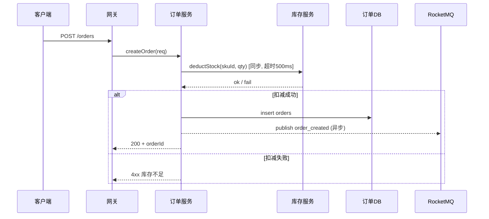

# 第 2 章 整体架构设计 — 撰写规范

## 章节目标

用一张架构图、一份组件清单、一份数据流图，让读者 5 分钟看懂"系统长什么样、谁负责什么、数据怎么流"。本章不展开实现细节，只确立"骨架"。

## 必写小节

### 2.1 架构总览

- 必须包含一张 **架构拓扑图**（推荐 Mermaid `flowchart` 或 PlantUML）。
- 图中必须区分：
  - 客户端 / 网关 / 业务服务 / 中间件 / 存储 / 外部依赖
  - 同步调用（实线）与异步调用（虚线 + 队列名）
  - 跨机房 / 跨地域边界（用色块或框线）
- 图下配 **3–5 段说明文字**，逐层解释关键路径，不要让读者自己脑补。

**Mermaid 示例**：

```mermaid
flowchart LR
    Client[客户端] --> Gateway[API 网关]
    Gateway -->|HTTPS| OrderSvc[订单服务]
    Gateway -->|HTTPS| UserSvc[用户服务]
    OrderSvc -->|读写| OrderDB[(MySQL: orders)]
    OrderSvc -->|缓存| Redis[(Redis 集群)]
    OrderSvc -.异步.->|订单事件| MQ[[RocketMQ: order_topic]]
    MQ -.->|消费| InventorySvc[库存服务]
    InventorySvc -->|读写| InvDB[(MySQL: inventory)]
```

### 2.2 核心组件清单及职责说明

字段化表格，**逐组件**列出：

| 组件 | 类型 | 职责（一句话） | 关键 SLA | 上游 | 下游 | 部署形态 |
|---|---|---|---|---|---|---|
| 订单服务 | 业务服务 | 受理订单创建/查询/取消 | P99≤150ms，可用性 99.95% | 网关 | OrderDB, Redis, MQ | K8s × 6 副本 |
| 订单 DB | 存储 | 订单主数据持久化 | RPO=0 | 订单服务 | — | MySQL 主从 + 半同步 |

**禁止**：
- 仅画图不列表，读者无法定位每个组件的职责边界。
- "订单服务负责所有订单相关功能" — 太笼统，无法验收。

### 2.3 组件间交互方式

每条关键交互链路必须说明：

| 字段 | 示例 |
|---|---|
| 调用方 → 被调方 | 订单服务 → 库存服务 |
| 调用方式 | 同步 RPC / 异步 MQ / Webhook |
| 协议 | gRPC（HTTP/2 + protobuf）/ HTTPS+JSON / RocketMQ 顺序消息 |
| 数据格式 | proto 文件路径 / OpenAPI Schema 链接 |
| 超时 | 连接 100ms，整体 500ms |
| 重试 | 最多 2 次，指数退避，仅幂等接口重试 |
| 限流 | 调用方侧 1000 QPS，被调方侧 1500 QPS |
| 熔断 | 错误率 > 30% 触发，半开 30s |
| 鉴权 | 内部 Service Mesh mTLS / OAuth2 / 签名 |

### 2.4 数据流图（关键业务场景）

至少为 **每个 P0 级 FR** 画一张数据流图（可用 Mermaid `sequenceDiagram`）。

**Mermaid 时序图示例**：



每张图配文字说明：
- 这个流程对应哪些 FR / NFR。
- 关键决策点（如同步还是异步、强一致还是最终一致）的理由。
- 异常分支（已在图中体现）。

## Checklist

- [ ] 架构拓扑图可读（不超过 15 个节点；超出则拆分图层）。
- [ ] 同步 / 异步、跨机房边界在图中显式标注。
- [ ] 组件清单表覆盖所有图中节点，且每个组件有明确职责与 SLA。
- [ ] 关键交互链路全部明确协议、超时、重试、限流、熔断、鉴权 7 项。
- [ ] 每个 P0 FR 都有对应数据流图，且包含异常分支。
- [ ] 图中术语与全文术语表一致（无别名）。
- [ ] 本章未展开实现细节（数据库表结构、接口字段等留到第 3 章）。

## 反模式

- ❌ **大杂烩拓扑图**：把 30 个组件画一张图，读者迷路 — 拆分为"宏观图 + 子模块图"。
- ❌ **只画 happy path**：异常分支不画 — 必须在时序图里体现。
- ❌ **组件名漂移**：图里叫"订单中心"，表里叫"订单服务"，详细设计里叫"order-svc" — 全文统一。
- ❌ **超时 / 重试缺失**：跨服务调用未声明超时 — 默认就会出现"雪崩"风险。
