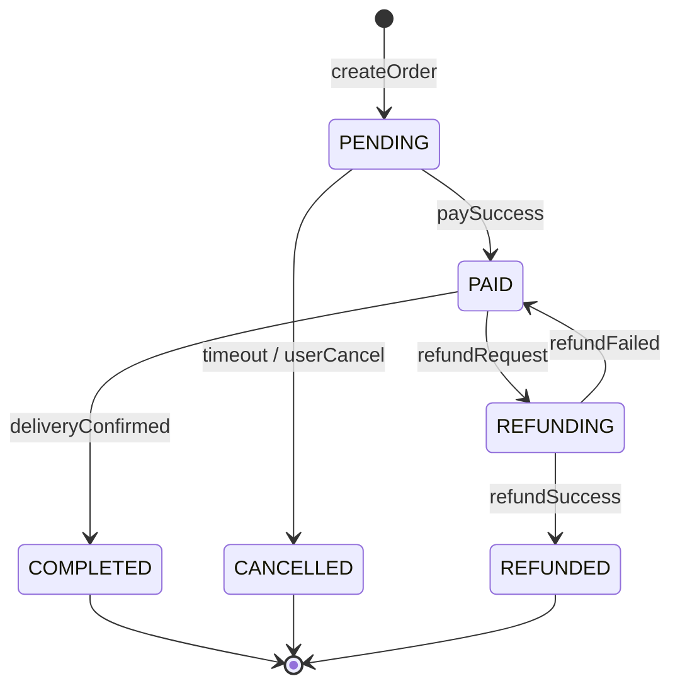

# 第 3 章 详细设计 — 撰写规范

## 章节目标

把第 2 章的"骨架"填充为 **可直接进入编码阶段** 的设计。包括数据模型、接口契约、核心流程、状态机。本章是开发同学的"工程蓝图"。

## 必写小节

### 3.1 关键存储与关键数据结构设计

> **必写**：列出本次涉及的**所有关键存储**（RDBMS 表 / 缓存 key / NoSQL / 消息主题）以及**进程内关键数据结构**（如核心 DTO / 事件体 / 状态对象）。判定"关键"的标准：参与核心链路、承载持久化数据、跨服务传递、对性能或一致性敏感。每个关键对象按下面字段化展开。

#### 3.1.1 数据库表结构（如使用 RDBMS）

**每张表**必须给出建表 DDL，并补充：

- 表名、主键、字符集、引擎。
- 字段：名称、类型、是否可空、默认值、含义、来源 FR/NFR。
- 索引：字段组合、索引类型、命中查询场景、预计选择度。
- 容量估算：单行字节数 × 1 年预期行数 = 总容量。
- 分库分表策略（如 sharding key、分片数、路由规则）。

**DDL 示例**：

```sql
CREATE TABLE orders (
    id            BIGINT      UNSIGNED NOT NULL AUTO_INCREMENT COMMENT '订单主键',
    order_no      VARCHAR(32) NOT NULL                          COMMENT '业务订单号',
    user_id       BIGINT      UNSIGNED NOT NULL                 COMMENT '用户ID',
    status        TINYINT     NOT NULL DEFAULT 0                COMMENT '0=待支付 1=已支付 2=已取消',
    amount_cents  BIGINT      NOT NULL                          COMMENT '订单金额，单位分',
    created_at    DATETIME(3) NOT NULL DEFAULT CURRENT_TIMESTAMP(3),
    updated_at    DATETIME(3) NOT NULL DEFAULT CURRENT_TIMESTAMP(3) ON UPDATE CURRENT_TIMESTAMP(3),
    PRIMARY KEY (id),
    UNIQUE KEY uk_order_no (order_no),
    KEY idx_user_created (user_id, created_at)
) ENGINE=InnoDB DEFAULT CHARSET=utf8mb4 COMMENT='订单主表';
```

补充说明：
- 单行 ≈ 200 字节，1 年 5 亿行 ≈ 100GB（NFR-006 容量评估）。
- 分片：按 `user_id % 32` 分 32 库，每库 ≈ 3GB，单库 1500 万行。
- 索引选择度评估：`idx_user_created` 单用户平均 < 200 行，可命中。

#### 3.1.2 缓存数据结构（如使用缓存）

每个 key 必须给出：
- key 模式（含命名空间、参数占位）：`order:detail:{orderId}`
- value 类型（String / Hash / ZSet）+ 序列化协议（JSON / protobuf）
- TTL 策略（固定 / 滑动 / 永久）
- 容量估算（数量 × 单条大小）
- 命中场景与失效策略
- 击穿 / 穿透 / 雪崩防护

#### 3.1.3 NoSQL / 大数据 Schema（如适用）

- ES：mapping、分词器、分片数、副本数、索引模板与生命周期。
- HBase：rowkey 设计、列族划分、热点防护。
- Kafka / RocketMQ：topic、partition、key 路由、保留期。

#### 3.1.4 关键内存 / 传输数据结构（如适用）

进程内或跨服务的**核心 DTO / 事件体 / 状态对象 / 缓存 value 结构**必须显式列出（不只是表 / key 名）：

| 名称 | 类型 | 关键字段（名 : 类型） | 序列化 | 大小估算 | 使用位置 | 兼容性策略 |
|---|---|---|---|---|---|---|
| `OrderCreatedEvent` | MQ 事件体 | orderNo / userId / amount / status / occurredAt | protobuf | ~80B | OrderSvc → MQ → Inv / Promo | 字段只增不删；废弃字段保留 90 天 |
| `OrderDetailVO` | 缓存 value | orderNo / status / items[] / amount / paidAt | JSON | ~1KB | `order:detail:{orderNo}` | 新字段 optional，老消费者忽略 |

> 仅为某一接口的入参 / 出参不必单列，只列**跨模块 / 持久化 / 长期存活**的关键结构。

### 3.2 核心接口设计

#### 3.2.1 接口契约

**每个接口**必须给出（**鉴权三要素 + 输入校验 + 错误回显** 是安全聚焦项，不可省）：

| 字段 | 说明 |
|---|---|
| 接口名 | `POST /v1/orders` |
| 用途 | 创建订单 |
| 鉴权 - 身份（防垂直越权） | OAuth2 user token；管理端额外 RBAC 角色检查 |
| 鉴权 - 资源归属（防水平越权 / IDOR） | 服务端**二次校验** `order.user_id == token.userId`；不得仅依赖 URL 参数 |
| 鉴权 - 角色 / 权限 | 列出可调用角色；前端隐藏的入口后端独立校验 |
| 入参 | 字段名、类型、是否必填、约束、示例 |
| 入参校验（防漏洞） | 强类型 + 长度上限 + 白名单 / 正则；禁止裸字符串拼接进 SQL / 命令 / URL；反序列化禁用原生 Java，使用类白名单 |
| 出参 | 字段名、类型、含义、示例 |
| 错误回显策略（防敏感信息泄露） | 统一错误结构；不回显 SQL / 堆栈 / 内部 IP / 完整路径 |
| 错误码 | 业务错误码表（见下） |
| 幂等性 | 通过 `Idempotency-Key` 头实现，TTL 24h |
| 限流 | 用户级 10 QPS / IP 级 100 QPS |
| 兼容性 | v1 不可破坏；新增字段 optional；废弃字段先告警 90 天再下线 |

**错误码表**：

| 错误码 | HTTP Status | 含义 | 客户端处理建议 |
|---|---|---|---|
| ORDER_4001 | 400 | 参数非法 | 不重试，提示用户 |
| ORDER_4002 | 400 | 库存不足 | 不重试，提示用户 |
| ORDER_4003 | 403 | 越权（资源不属于当前用户） | 不重试，引导回首页 |
| ORDER_5001 | 503 | 下游依赖暂不可用 | 指数退避重试 ≤ 3 次 |
| ORDER_5002 | 504 | 超时但不确定结果 | 用同 Idempotency-Key 重试 |

#### 3.2.2 OpenAPI / proto 片段

至少给出 1 个核心接口的 OpenAPI / proto 片段示例，便于评审：

```yaml
paths:
  /v1/orders:
    post:
      summary: 创建订单
      parameters:
        - in: header
          name: Idempotency-Key
          required: true
          schema: { type: string, maxLength: 64 }
      requestBody:
        required: true
        content:
          application/json:
            schema:
              type: object
              required: [skuId, quantity]
              properties:
                skuId:    { type: string }
                quantity: { type: integer, minimum: 1, maximum: 100 }
      responses:
        '200':
          description: 创建成功
          content:
            application/json:
              schema:
                type: object
                properties:
                  orderNo: { type: string }
                  amount:  { type: integer }
```

### 3.3 核心流程设计

**每个 P0 流程**用步骤化方式描述，**逐步**标注：

```
Step N — <步骤名>
  - 输入：xxx
  - 处理：xxx
  - 输出：xxx
  - 异常：xxx → 如何处理（重试 / 补偿 / 降级 / 直接失败）
  - 超时：xxx ms → 超时后行为
  - 幂等：xxx
```

**示例（订单创建）**：

```
Step 1 — 参数校验
  - 输入：HTTP body + Idempotency-Key
  - 处理：JSON 解析、字段校验、库存可用性预检
  - 输出：DTO
  - 异常：参数非法 → 直接返回 ORDER_4001
  - 超时：N/A
  - 幂等：基于 Idempotency-Key 查重，命中直接返回历史结果

Step 2 — 同步扣减库存
  - 输入：skuId, quantity
  - 处理：调用库存服务 deductStock
  - 输出：扣减成功/失败
  - 异常：失败 → 返回 ORDER_4002；超时但状态未知 → 见 Step 5 补偿
  - 超时：500ms
  - 幂等：库存服务内部基于 deductId 幂等

Step 3 — 写订单 DB
  - 输入：DTO + 扣减成功标记
  - 处理：INSERT orders (status=0)
  - 输出：order_no, id
  - 异常：唯一键冲突（同 Idempotency-Key 并发）→ 查询并返回历史订单
  - 超时：DB 200ms
  - 幂等：UNIQUE KEY uk_order_no

Step 4 — 发布订单创建事件（异步）
  - 输入：orderNo
  - 处理：同步事务表 + 异步投递 RocketMQ（事务消息）
  - 输出：消息已投递或事务表待补偿
  - 异常：MQ 投递失败 → 由补偿任务扫描事务表重投
  - 超时：MQ 投递 200ms
  - 幂等：消费端按 orderNo 去重

Step 5 — 异常补偿（独立常驻任务）
  - 触发：扣减成功但订单未成功落库；扣减状态未知
  - 处理：定时扫描 30s 前的未决记录，调用库存服务对账接口判定真实状态
  - 输出：补偿日志
  - 频率：每 10 秒一次
```

### 3.4 状态机设计

**涉及状态流转的实体**必须给出状态图（Mermaid `stateDiagram-v2`）+ 流转表。



**状态流转表**：

| from | to | 触发事件 | 守卫条件 | 副作用 | 是否可逆 |
|---|---|---|---|---|---|
| PENDING | PAID | paySuccess | 支付回调签名校验通过 | 释放占用库存 → 真实扣减；发 MQ | 否 |
| PENDING | CANCELLED | timeout | 超过 30 分钟未支付 | 回滚库存 | 否 |
| PAID | REFUNDING | refundRequest | 距离支付 ≤ 7 天 | 锁定订单不可发货 | 是（流回 PAID） |

## Checklist

- [ ] **关键存储**全部覆盖：每张关键表给出 DDL + 索引说明 + 容量估算 + 分片策略；每个关键缓存 key / NoSQL Schema / MQ 主题给出对应字段表。
- [ ] **关键数据结构**已列出（跨模块 DTO / 事件体 / 状态对象 / 缓存 value），含序列化、大小估算、兼容性策略。
- [ ] 缓存 key 给出命名规范、TTL、容量、击穿/穿透/雪崩防护。
- [ ] 每个接口给出入参 / 出参 / 错误码 / 幂等 / 限流 / **鉴权三要素（身份 + 资源归属 + 角色）** / **输入校验** / **错误回显策略** / 兼容性。
- [ ] 至少提供 1 个 OpenAPI/proto 片段。
- [ ] 每个 P0 流程按 Step 模板写完，每步包含输入 / 输出 / 异常 / 超时 / 幂等；涉及鉴权步骤显式标注资源归属校验。
- [ ] 流程必须包含异常路径与补偿路径，不只 happy path。
- [ ] 状态机实体给出状态图 + 流转表，包含守卫条件与副作用。
- [ ] 所有字段、表名、组件名与第 2 章保持一致（术语统一）。

## 反模式

- ❌ **DDL 没索引** — 评审时无法判断查询是否命中。
- ❌ **接口字段没约束** — `name: string` 不写最大长度，攻击面无限。
- ❌ **错误码"待补充"** — 客户端无法实现重试策略。
- ❌ **流程只写 happy path** — 真实故障必出问题。
- ❌ **状态机只画图不列流转表** — 守卫条件与副作用丢失。
- ❌ **无幂等设计** — 网络抖动重试就会重复扣款。
- ❌ **越权盲区** — 接口仅依赖 URL / 入参中的 ID，不做资源归属校验，等于 IDOR 直接送货上门。
- ❌ **输入裸拼接** — 用户输入直接进 SQL / 命令 / URL / 反序列化，是注入与 RCE 的源头。
- ❌ **错误回显泄露内部信息** — 把堆栈 / SQL / 内网 IP 直接吐给客户端，等于免费给攻击者送图纸。
