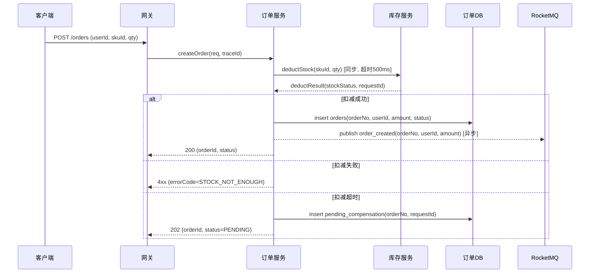

# 第 3 章 详细设计 — 撰写规范

## 章节目标

把第 2 章的"骨架"填充为 **可直接进入编码阶段** 的设计。包括数据模型、接口契约、核心流程（含数据流图），以及按需保留的状态机设计。本章是开发同学的"工程蓝图"。若本方案基于已有系统演进，本章每个关键设计对象必须标注 `[新增]` / `[修改]` / `[复用]`，并与 §2.1 架构图、§2.2 核心组件与变更清单保持一致。

> **核心流程统一收口**：每个 P0 流程在 §3.3 一处说清楚——先用 Step 模板描述步骤（输入 / 处理 / 输出 / 异常 / 超时 / 幂等），再用 Mermaid `sequenceDiagram` 数据流图可视化同一条链路的参与方与读写点；不要分别在两处重复描述。

## 小节要求

§3.0–§3.3 为必写；§3.4 状态机设计仅在存在明显状态机强相关对象时保留。若不存在多状态业务对象、事件驱动流转、守卫条件和副作用等设计内容，最终方案应省略 §3.4，不写占位段落。

### 3.0 详细设计变更标注规则（已有系统演进必写）

若本方案是在已有系统上修改，§3 所有可落代码 / 落配置 / 落数据结构的对象都必须标注变更动作：

| 对象类型 | 标注位置 | 标注要求 |
|---|---|---|
| 表 / 缓存 key / MQ topic / NoSQL schema | 小节标题或表格首列 | `[新增]` / `[修改]` / `[复用]`，修改项说明新增字段、索引、TTL、分区等具体变化 |
| DTO / 事件体 / 状态对象 | 关键数据结构表 | 标注结构是新增、修改还是复用；修改项说明兼容策略 |
| 接口 / RPC / 事件契约 | 接口标题或契约表 | 标注新增接口、修改接口、复用接口；修改项说明入参、出参、错误码、兼容性变化 |
| 核心流程（含数据流图） | 标题或说明首行 | 标注流程是新增、修改还是复用；修改项说明相对现状新增的步骤、分支或读写点 |
| 状态机（如保留） | 标题或说明首行 | 标注状态机是新增、修改还是复用；修改项说明相对现状新增、调整或废弃的状态流转 |

> 新建系统可声明"本章对象均为 `[新增]`"，无需逐项重复；已有系统改造不能省略标注。

### 3.1 关键存储与关键数据结构设计

> **必写**：列出本次涉及的**所有关键存储**（RDBMS 表 / 缓存 key / NoSQL / 消息主题）以及**进程内关键数据结构**（如核心 DTO / 事件体 / 状态对象）。判定"关键"的标准：参与核心链路、承载持久化数据、跨服务传递、对性能或一致性敏感。每个关键对象按下面字段化展开。

#### 3.1.1 数据库表结构（如使用 RDBMS）

**每张表**必须给出**字段级结构表**（不要求提供可执行 DDL），并补充：

- 表名、主键、字符集 / 引擎（要点列出）。
- 字段表：名称、类型、是否可空、默认值、含义、来源 FR/NFR。
- 索引：字段组合、索引类型、命中查询场景、预计选择度。
- 容量估算：单行字节数 × 1 年预期行数 = 总容量。
- 分库分表策略（如 sharding key、分片数、路由规则）。

> **不写可执行代码片段**：表结构以字段表呈现，不要求给出可直接执行的 `CREATE TABLE` 语句——具体 DDL 语法（字符集 / 引擎 / 字段精度等）容易与仓库真实迁移脚本、ORM 模型或既有规范不一致，误导开发直接照抄。如确需示意整体结构，可用简化伪代码替代完整 SQL，并标注"示意，非最终实现"。

**字段表示例（订单主表）**：

| 字段名 | 类型 | 可空 | 默认值 | 含义 | 来源 |
|---|---|---|---|---|---|
| id | BIGINT UNSIGNED | 否 | 自增 | 订单主键 | — |
| order_no | VARCHAR(32) | 否 | — | 业务订单号 | FR-001 |
| user_id | BIGINT UNSIGNED | 否 | — | 用户 ID | FR-001 |
| status | TINYINT | 否 | 0 | 0=待支付 1=已支付 2=已取消 | FR-002 |
| amount_cents | BIGINT | 否 | — | 订单金额，单位分 | FR-001 |
| created_at | DATETIME(3) | 否 | 当前时间 | 创建时间 | — |

索引：`uk_order_no`（唯一，order_no，命中订单号精确查询）；`idx_user_created`（user_id + created_at，命中用户订单列表，预计选择度单用户 < 200 行，可命中）。

补充说明：
- 单行 ≈ 200 字节，1 年 5 亿行 ≈ 100GB（NFR-006 容量评估）。
- 分片：按 `user_id % 32` 分 32 库，每库 ≈ 3GB，单库 1500 万行。

#### 3.1.2 缓存数据结构（如使用缓存）

每个 key 必须给出：
- key 模式（含命名空间、参数占位）：`order:detail:{orderId}`
- value 类型（String / Hash / ZSet）+ 序列化协议（JSON / protobuf）
- TTL 策略（固定 / 滑动 / 永久）
- 容量估算（数量 × 单条大小）
- 命中场景与失效策略
- 击穿 / 穿透 / 雪崩防护

#### 3.1.3 NoSQL / 大数据 Schema（如适用）

- ES：mapping、分词器、分片数、副本数、索引模板与生命周期。
- HBase：rowkey 设计、列族划分、热点防护。
- Kafka / RocketMQ：topic、partition、key 路由、保留期。

#### 3.1.4 关键内存 / 传输数据结构（如适用）

进程内或跨服务的**核心 DTO / 事件体 / 状态对象 / 缓存 value 结构**必须显式列出（不只是表 / key 名）：

| 名称 | 变更动作 | 类型 | 关键字段（名 : 类型） | 序列化 | 大小估算 | 使用位置 | 兼容性策略 |
|---|---|---|---|---|---|---|---|
| `OrderCreatedEvent` | [修改] | MQ 事件体 | orderNo / userId / amount / status / occurredAt | protobuf | ~80B | OrderSvc → MQ → Inv / Promo | 字段只增不删；废弃字段保留 90 天 |
| `OrderDetailVO` | [复用] | 缓存 value | orderNo / status / items[] / amount / paidAt | JSON | ~1KB | `order:detail:{orderNo}` | 新字段 optional，老消费者忽略 |

> 仅为某一接口的入参 / 出参不必单列，只列**跨模块 / 持久化 / 长期存活**的关键结构。

### 3.2 核心接口设计

#### 3.2.1 接口契约

**每个接口**必须在标题或契约表中标注 `[新增]` / `[修改]` / `[复用]`，并给出（**鉴权三要素 + 输入校验 + 错误回显** 是安全聚焦项，不可省）：

| 字段 | 说明 |
|---|---|
| 接口名 | `POST /v1/orders` |
| 变更动作 | [新增] / [修改] / [复用] |
| 变更摘要 | 修改接口需说明新增 / 调整的入参、出参、错误码或兼容性变化 |
| 用途 | 创建订单 |
| 鉴权 - 身份（防垂直越权） | OAuth2 user token；管理端额外 RBAC 角色检查 |
| 鉴权 - 资源归属（防水平越权 / IDOR） | 服务端**二次校验** `order.user_id == token.userId`；不得仅依赖 URL 参数 |
| 鉴权 - 角色 / 权限 | 列出可调用角色；前端隐藏的入口后端独立校验 |
| 入参 | 字段名、类型、是否必填、约束、示例 |
| 入参校验（防漏洞） | 强类型 + 长度上限 + 白名单 / 正则；禁止裸字符串拼接进 SQL / 命令 / URL；反序列化禁用原生 Java，使用类白名单 |
| 出参 | 字段名、类型、含义、示例 |
| 错误回显策略（防敏感信息泄露） | 统一错误结构；不回显 SQL / 堆栈 / 内部 IP / 完整路径 |
| 错误码 | 业务错误码表（见下） |
| 幂等性 | 通过 `Idempotency-Key` 头实现，TTL 24h |
| 限流 | 用户级 10 QPS / IP 级 100 QPS |
| 兼容性 | v1 不可破坏；新增字段 optional；废弃字段先告警 90 天再下线 |

**错误码表**：

| 错误码 | HTTP Status | 含义 | 客户端处理建议 |
|---|---|---|---|
| ORDER_4001 | 400 | 参数非法 | 不重试，提示用户 |
| ORDER_4002 | 400 | 库存不足 | 不重试，提示用户 |
| ORDER_4003 | 403 | 越权（资源不属于当前用户） | 不重试，引导回首页 |
| ORDER_5001 | 503 | 下游依赖暂不可用 | 指数退避重试 ≤ 3 次 |
| ORDER_5002 | 504 | 超时但不确定结果 | 用同 Idempotency-Key 重试 |

#### 3.2.2 接口契约补充说明（不要求可执行 OpenAPI / proto 代码片段）

核心接口的入参 / 出参结构已在 §3.2.1 契约表中字段级描述，足以支撑评审，**不强制**提供 OpenAPI / proto 代码片段——实际 schema 应以仓库既有契约管理方式（IDL 文件、契约仓库、网关配置等）为准，方案里重复编写容易与真实实现产生出入、误导直接照抄。若入参 / 出参存在复杂嵌套结构，可用**简化字段树 / 伪代码**示意层级关系，并标注"示意，非最终 schema"，不追求语法可执行。

### 3.3 核心流程与数据流图

本节是核心流程的**唯一**承载位置：每个 P0 级 FR 一个子小节，**Step 步骤描述 + 一张 Mermaid `sequenceDiagram` 数据流图** 同处呈现，避免文字与图分散在两节。

通用要求：

- 每个流程在标题标注 `[新增]` / `[修改]` / `[复用]`，并标明对应 FR；修改流程必须说明相对现状新增的步骤、异常分支或补偿点。
- 时序图**必须使用 `sequenceDiagram`，不要使用 `flowchart` / 流程图**；流程图无法充分表达调用顺序、参与方、读写数据、同步 / 异步边界和异常回包。
- 时序图需体现：参与方与职责边界、关键调用传递的核心数据项、关键存储 / 缓存 / MQ 的读写点及写入字段、同步 / 异步边界、异常分支与补偿动作。
- Step 模板和时序图描述**同一条链路**：图中出现的参与方与关键调用必须能在 Step 中找到对应步骤，反之亦然。

Step 模板：


```
Step N — <步骤名>
  - 输入：xxx
  - 处理：xxx
  - 输出：xxx
  - 异常：xxx → 如何处理（重试 / 补偿 / 降级 / 直接失败）
  - 超时：xxx ms → 超时后行为
  - 幂等：xxx
```

**示例（订单创建）**：

```
Step 1 — 参数校验
  - 输入：HTTP body + Idempotency-Key
  - 处理：JSON 解析、字段校验、库存可用性预检
  - 输出：DTO
  - 异常：参数非法 → 直接返回 ORDER_4001
  - 超时：N/A
  - 幂等：基于 Idempotency-Key 查重，命中直接返回历史结果

Step 2 — 同步扣减库存
  - 输入：skuId, quantity
  - 处理：调用库存服务 deductStock
  - 输出：扣减成功/失败
  - 异常：失败 → 返回 ORDER_4002；超时但状态未知 → 见 Step 5 补偿
  - 超时：500ms
  - 幂等：库存服务内部基于 deductId 幂等

Step 3 — 写订单 DB
  - 输入：DTO + 扣减成功标记
  - 处理：INSERT orders (status=0)
  - 输出：order_no, id
  - 异常：唯一键冲突（同 Idempotency-Key 并发）→ 查询并返回历史订单
  - 超时：DB 200ms
  - 幂等：UNIQUE KEY uk_order_no

Step 4 — 发布订单创建事件（异步）
  - 输入：orderNo
  - 处理：同步事务表 + 异步投递 RocketMQ（事务消息）
  - 输出：消息已投递或事务表待补偿
  - 异常：MQ 投递失败 → 由补偿任务扫描事务表重投
  - 超时：MQ 投递 200ms
  - 幂等：消费端按 orderNo 去重

Step 5 — 异常补偿（独立常驻任务）
  - 触发：扣减成功但订单未成功落库；扣减状态未知
  - 处理：定时扫描 30s 前的未决记录，调用库存服务对账接口判定真实状态
  - 输出：补偿日志
  - 频率：每 10 秒一次
```

**对应数据流图（同一条链路的可视化）**：




每张图配文字说明（不与上方 Step 重复，只补充图中无法表达的内容）：
- 关键决策点（如同步还是异步、强一致还是最终一致）的理由。
- 该流程对应的 NFR（性能 / 可用性 / 一致性）数字。
- 与现状链路相比新增或调整的参与方、读写点、异常分支（已有系统演进必填）。

### 3.4 状态机设计（按需保留）

仅当存在明显与状态机强相关的业务对象时保留本节，例如订单 / 工单 / 审批 / 任务 / 支付 / 退款等对象存在多状态、事件驱动流转、守卫条件、副作用、可逆 / 不可逆分支。

若只是简单布尔标记、单次状态字段展示，或状态变化已在 §3.3 核心流程与数据流图中表达清楚，最终方案应省略整个 §3.4，不写"本场景不涉及"占位段落。

**涉及状态流转的实体**必须给出状态流转表；状态简单且渲染环境确认支持时，可补充 Mermaid 状态图。状态 ID 使用英文大写或下划线；事件文本保持短句；复杂条件放到流转表，避免在图中写长文本、HTML 标签或 emoji。

**状态流转表**：

| from | to | 触发事件 | 守卫条件 | 副作用 | 是否可逆 |
|---|---|---|---|---|---|
| PENDING | PAID | paySuccess | 支付回调签名校验通过 | 释放占用库存 → 真实扣减；发 MQ | 否 |
| PENDING | CANCELLED | timeout | 超过 30 分钟未支付 | 回滚库存 | 否 |
| PAID | REFUNDING | refundRequest | 距离支付 ≤ 7 天 | 锁定订单不可发货 | 是（流回 PAID） |

## Checklist

- [ ] 已有系统演进：§3 所有关键对象（存储、缓存、MQ、DTO、接口、流程含数据流图、状态机（如保留））已标注 `[新增]` / `[修改]` / `[复用]`，且与 §2.1 / §2.2 一致。
- [ ] **关键存储**全部覆盖：每张关键表给出字段表（不要求可执行 DDL）+ 索引说明 + 容量估算 + 分片策略；每个关键缓存 key / NoSQL Schema / MQ 主题给出对应字段表。
- [ ] **关键数据结构**已列出（跨模块 DTO / 事件体 / 状态对象 / 缓存 value），含序列化、大小估算、兼容性策略。
- [ ] 缓存 key 给出命名规范、TTL、容量、击穿/穿透/雪崩防护。
- [ ] 每个接口给出入参 / 出参 / 错误码 / 幂等 / 限流 / **鉴权三要素（身份 + 资源归属 + 角色）** / **输入校验** / **错误回显策略** / 兼容性；均以契约表呈现，不要求可执行 OpenAPI/proto 代码片段。
- [ ] 每个 P0 流程在 §3.3 一处给出：Step 模板（输入 / 输出 / 异常 / 超时 / 幂等，涉及鉴权显式标注资源归属校验）+ 一张 `sequenceDiagram` 数据流图，覆盖异常路径与补偿路径，不只 happy path。
- [ ] Step 描述与数据流图描述同一条链路，参与方、关键调用、读写点一致，无两处重复或漂移。
- [ ] 若存在明显状态机强相关实体，§3.4 已保留并给出流转表（状态图可选），包含守卫条件与副作用；若不存在，最终方案已省略 §3.4。
- [ ] 所有字段、表名、组件名与第 2 章保持一致（术语统一）。

## 反模式

- ❌ **字段表没索引说明** — 评审时无法判断查询是否命中。
- ❌ **编造/挪用可执行代码片段（DDL、接口实现、配置文件语法等）当作最终实现** — 容易跟仓库真实规范、既有代码或最终落地产生出入，误导开发直接照抄；应改用字段表 / 契约表或标注"示意"的简化伪代码。
- ❌ **接口字段没约束** — `name: string` 不写最大长度，攻击面无限。
- ❌ **错误码"待补充"** — 客户端无法实现重试策略。
- ❌ **流程只写 happy path** — 真实故障必出问题。
- ❌ **变更动作不标注** — 基于已有系统改造时，详细设计只写目标态，不说明哪些对象新增 / 修改 / 复用，开发和评审无法判断真实改动范围。
- ❌ **无状态机却硬写占位，或有状态机只画图不列流转表** — 前者造成章节噪音，后者丢失守卫条件与副作用。
- ❌ **无幂等设计** — 网络抖动重试就会重复扣款。
- ❌ **越权盲区** — 接口仅依赖 URL / 入参中的 ID，不做资源归属校验，等于 IDOR 直接送货上门。
- ❌ **输入裸拼接** — 用户输入直接进 SQL / 命令 / URL / 反序列化，是注入与 RCE 的源头。
- ❌ **错误回显泄露内部信息** — 把堆栈 / SQL / 内网 IP 直接吐给客户端，等于免费给攻击者送图纸。
