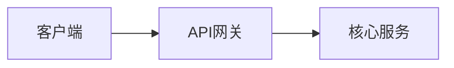

# 简要技术方案（候选评审稿） — {方案名称}

> 元信息：v0.1｜YYYY-MM-DD｜{作者}｜阶段：A（候选评审中）
> 状态：阶段A自检 {✅ 通过 / ❌ 不通过}（QA-1/QA-2/QA-3，详见 `.qiqskills/<方案名>/quality-check.md`）
> 过程产物：`.qiqskills/<方案名>/`（需求、候选反馈记录）

> 本文件为**阶段 A** 交付物，写入路径为用户指定或默认派生的 `<BRIEF_DOC_PATH>`。待用户在本文档或对话中明确"选定候选 + 调整信息"后，才驱动阶段 B 产出 `<TECH_DOC_PATH>`；在此之前不得展开详细设计。

---

## 0. 元信息

（见文档头部：版本、日期、作者、阶段、自检状态、过程产物链接）

## 1. 需求摘要

> 完整字段见 `.qiqskills/<方案名>/requirements.md`；本节只放锚定候选设计所需的摘要。

### 1.1 业务背景（≤5 句，含可量化目标）

### 1.2 FR 摘要表

| 编号 | 标题 | 优先级 | 验收关键指标 |
|---|---|---|---|
| FR-001 | | P0 | |

### 1.3 NFR 摘要表

| 编号 | 维度 | 关键数字 |
|---|---|---|
| NFR-001 | 可用性 SLA | |
| NFR-002 | 性能（QPS/延迟） | |
| NFR-003 | 安全（越权/漏洞） | |
| NFR-004 | 可观测性 | |

## 2. 候选总览

| CAND-ID | 一句话定位 | 关键互斥维度 | 推荐标记 |
|---|---|---|---|
| CAND-001 | | | |
| CAND-002 | | | |

> 候选 ≥ 2；候选之间须在至少 1 个关键维度上互斥（如核心存储、部署形态、同步/异步），避免同质化候选。若用户明确只需 1 个候选，仍须保留 1 个被否决的对照候选 + 否决理由，并登记为 ASMP-。

## 3. 候选详述

### CAND-001：{候选名称}

#### 3.1 整体架构

- 组件清单：
- 关键交互方式（同步 / 异步 / 消息）：

#### 3.2 核心数据设计

- 核心实体 / 表 / 集合（关键字段、主键、分片 / 索引策略）：
- 关键存储选型与理由：
- 容量与扩展轴：

#### 3.3 关键技术选型要点（1–3 项，仅列与本候选成立强相关项）

-

#### 3.4 风险代价

- 复杂度：
- 成本：
- 对现有工程影响：
- 主要 RISK- / ASMP-：

#### 3.5 FR/NFR 覆盖速览

| 编号 | 是否满足 | 说明 |
|---|---|---|
| FR-001 | ✅ / ⚠️ / ❌ | |
| NFR-001 | ✅ / ⚠️ / ❌ | |

---

### CAND-002：{候选名称}

（重复 3.1–3.5 结构）

---

## 4. 候选对比矩阵

| 维度 | CAND-001 | CAND-002 |
|---|---|---|
| 一致性 | | |
| 性能 | | |
| 成本 | | |
| 复杂度 | | |
| 扩展性 | | |
| 风险 | | |
| 对现有系统冲击 | | |

> 单元格写定性结论 + 必要量化指标，禁止"更好 / 更合适"等无依据陈述。

## 5. 推荐与待决问题

**推荐候选**：CAND-00X

**推荐理由**（≤ 5 行，逐条引用上方对比矩阵中的具体维度或数字）：
1.
2.

**待决问题**（TBD，需要用户决策的开放点；完整记录见 `.qiqskills/<方案名>/open-questions.md`）：
-

---

> 请回复：**选定候选编号 + 调整信息**，或说明需要新增 / 修改的候选。在收到明确反馈前，本方案不会进入详细设计阶段。
