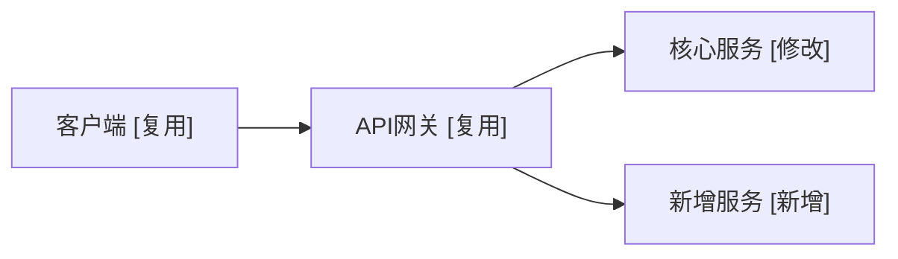
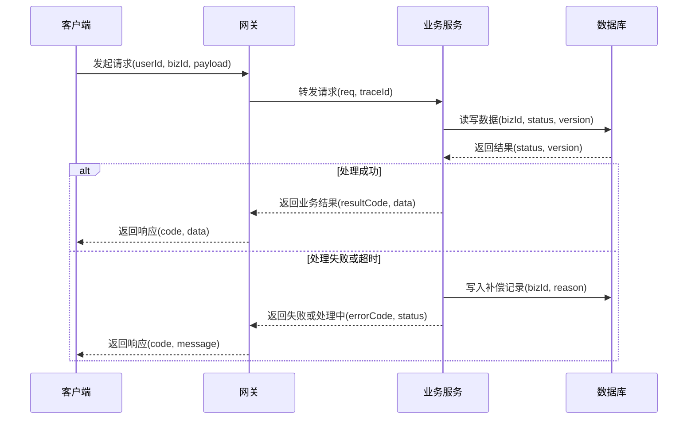

# 技术方案 — {方案名称}

> 元信息：v1.0｜YYYY-MM-DD｜{作者}｜{完整产出 / 草案}
> 状态：置信度 {高 / 中 / 低}｜门禁 {✅ 通过 / ⚠️ 有条件通过 / ❌ 不通过 / 📝 草案}｜待确认 {N 条 TBD / M 条 TODO}{｜篇幅放开：确认人 + 日期 + 理由（仅单篇超过 900 行且人工确认时保留）}
> 过程产物：`.qiqskills/<方案名>/`（需求、门禁、待确认、历史变更）

> 本文件为最终交付的技术方案，写入路径为用户指定的 `<TECH_DOC_PATH>`，与过程产物目录严格分离。

---

## 第 1 章 需求分析（精简）

> 本章为摘要形态。FR / NFR / 约束 / 假设的完整字段（描述、验收标准、来源等）保存在 `.qiqskills/<方案名>/requirements.md`，本章仅列摘要 + 关键数字。

### 1.1 业务背景与目标

> 1 段（≤ 5 句）：当前在哪里 / 痛点是什么 / 期望到哪里；包含可量化的业务目标。

### 1.2 功能性需求摘要（FR）

| 编号 | 标题 | 优先级 | 验收关键指标 |
|---|---|---|---|
| FR-001 | | P0 | |

> 完整字段（描述、输入输出、来源等）见 `.qiqskills/<方案名>/requirements.md`。

### 1.3 非功能性需求摘要（NFR）

> **必填 4 项**：可用性 / 性能（QPS + 延迟）/ 安全（越权 + 漏洞）/ 可观测性。
> **按场景适当覆盖**：一致性、容量、RPO/RTO、可维护性、可扩展性、成本。在下表中按需追加行即可。

| 编号 | 维度 | 必填? | 关键数字 |
|---|---|---|---|
| NFR-001 | 可用性 SLA | 必 | |
| NFR-002 | 性能（QPS） | 必 | |
| NFR-003 | 性能（延迟 P99） | 必 | |
| NFR-004 | 安全（含越权 / 漏洞防护） | 必 | |
| NFR-005 | 可观测性 | 必 | |
| NFR-006 | …（按场景追加，如一致性 / 容量 / RPO/RTO / 可维护性 / 可扩展性 / 成本） | 适当 | |

### 1.4 约束与假设要点

- **关键约束**（要点列出）：技术栈 / 团队 / 时间窗 / 预算 / 组织依赖。
- **关键假设摘要**：共 N 条 ASMP，影响最大的 ≤ 3 条要点列出；完整列表见 `.qiqskills/<方案名>/requirements.md`。

### 1.5 边界声明

- **本方案覆盖**：
- **本方案不覆盖**（及理由）：
- **与上下游边界**：

---

## 第 2 章 整体架构设计

### 2.1 架构总览（加上本需求之后）



> 拓扑说明（3–5 段）：说明目标态架构、关键链路、变更点和影响范围。

### 2.2 核心组件与变更清单

| 组件 | 类型 | 变更动作 | 职责 | 关键 SLA | 上游 | 下游 | 部署形态 | 变更摘要 | 影响接口 / 字段 / 兼容性 | 对应需求 |
|---|---|---|---|---|---|---|---|---|---|---|
| 服务 / 模块 / 存储 / MQ / 缓存命名空间 | | [新增] / [修改] / [复用] | | | | | | | | |

**影响面摘要**：
- **新增范围**：
- **修改范围**：
- **复用范围**：
- **不改范围**：

### 2.3 组件间交互方式

| 调用方→被调方 | 方式 | 协议 | 数据格式 | 超时 | 重试 | 限流 | 熔断 | 鉴权 |
|---|---|---|---|---|---|---|---|---|
| | | | | | | | | |

### 2.4 工程一致性原则（已有工程必填；新建工程显式声明并可省略表格）

| 项 | 当前工程约定 | 本次方案是否遵循 | 偏离说明（如有，需同步在 §4 立卡） |
|---|---|---|---|
| 目录结构与分层 | | | |
| 命名规范（包 / 类 / 方法 / DB 表 / 字段 / 错误码前缀） | | | |
| 错误码体系与异常处理 | | | |
| 日志格式与字段、监控埋点 SDK | | | |
| 配置中心 / 限流熔断 / RPC / ORM 等基础组件 | | | |
| 依赖管理与发布流程 | | | |

---

## 第 3 章 详细设计

### 3.0 详细设计变更标注规则

> 已有系统演进：本章所有关键对象需标注 `[新增]` / `[修改]` / `[复用]`，并与 §2.1 架构图、§2.2 核心组件与变更清单一致。新建系统可声明"本章对象均为 `[新增]`"。

### 3.1 关键存储与关键数据结构设计

#### 3.1.1 数据库表

> 不要求提供可执行 DDL，用字段表描述结构；确需示意整体结构可用简化伪代码，并标注"示意，非最终实现"。

| 字段名 | 类型 | 可空 | 默认值 | 含义 | 来源 |
|---|---|---|---|---|---|
| | | | | | |

容量估算：
分片策略：
索引说明：

#### 3.1.2 缓存设计

| Key 模式 | Value 类型 | TTL | 容量估算 | 命中场景 | 击穿/穿透/雪崩防护 |
|---|---|---|---|---|---|
| | | | | | |

#### 3.1.3 NoSQL / 大数据 / MQ Schema

> 如不涉及，写"本场景不涉及，原因：……"

#### 3.1.4 关键内存 / 传输数据结构

> 跨模块 / 跨服务 / 持久化 的核心 DTO / 事件体 / 状态对象 / 缓存 value 结构。

| 名称 | 变更动作 | 类型 | 关键字段 | 序列化 | 大小估算 | 使用位置 | 兼容性策略 |
|---|---|---|---|---|---|---|---|
| | [新增] / [修改] / [复用] | | | | | | |

### 3.2 核心接口设计

#### 接口 1：`{HTTP 方法} {路径}`（[新增] / [修改] / [复用]）

| 字段 | 内容 |
|---|---|
| 变更动作 | [新增] / [修改] / [复用] |
| 变更摘要 | |
| 用途 | |
| 鉴权（身份） | |
| 鉴权（资源归属，防水平越权） | 例：服务端校验 `resource.owner_id == token.userId` |
| 鉴权（角色 / 权限，防垂直越权） | |
| 入参 | |
| 入参校验（防注入 / 反序列化等） | |
| 出参 | |
| 错误回显策略（避免敏感信息泄露） | |
| 幂等性 | |
| 限流 | |
| 兼容性 | |

错误码：

| 错误码 | HTTP Status | 含义 | 客户端处理建议 |
|---|---|---|---|
| | | | |

接口契约补充说明（不要求可执行 OpenAPI / proto 代码片段，复杂嵌套结构可用简化字段树 / 伪代码示意）：

### 3.3 核心流程与数据流图

> 每个 P0 级 FR 一个子小节，**Step 步骤描述 + 一张 Mermaid `sequenceDiagram` 数据流图** 同处呈现；不要把流程文字与时序图拆到两节。
>
> 数据流图必须使用 `sequenceDiagram`，不要使用 `flowchart` / 流程图；需表达参与方、调用顺序、核心数据项、存储 / 缓存 / MQ 读写点、同步 / 异步边界和异常 / 补偿回包。Step 描述与时序图必须对应同一条链路。

#### 流程 1：{流程名}（[新增] / [修改] / [复用]，对应 FR-XXX）

**Step 步骤**：

```
Step 1 — <步骤名>
  输入：
  处理：
  输出：
  异常：
  超时：
  幂等：
  鉴权与越权校验：（如涉及）

Step 2 — ...
```

**数据流图**：



> 图下补充说明（不与 Step 重复）：关键决策点理由、对应 NFR 数字、相对现状新增或调整的参与方 / 读写点 / 异常分支。

### 3.4 状态机设计（按需保留）

> 仅当存在明显与状态机强相关的业务对象时保留本节，例如订单 / 工单 / 审批 / 任务 / 支付 / 退款等对象存在多状态、事件驱动流转、守卫条件、副作用、可逆 / 不可逆分支。
> 若只是简单布尔标记、单次状态字段展示，或状态变化已在 §3.3 核心流程与数据流图中表达清楚，最终方案应省略整个 §3.4，不写"本场景不涉及"占位段落。

#### 实体：{实体名}（[新增] / [修改] / [复用]）

> 状态图可选；若渲染环境支持且状态较少，可补充 Mermaid 状态图。必须保留下方流转表；修改状态机需说明新增 / 调整 / 废弃的状态流转。

| from | to | 触发事件 | 守卫条件 | 副作用 | 是否可逆 |
|---|---|---|---|---|---|
| | | | | | |

---

## 第 4 章 关键技术决策

### 决策 D-1：{决策点标题}

**决策点**：

**可选方案**：
- 方案 A：
- 方案 B：
- 方案 C：

**对比分析**：

| 维度 | 方案 A | 方案 B | 方案 C |
|---|---|---|---|
| 满足需求度 | | | |
| 实现复杂度 | | | |
| 性能 | | | |
| 可用性 | | | |
| 可维护性 | | | |
| 团队熟悉度 | | | |
| 引入成本 | | | |
| 演进空间 | | | |

**最终选择**：

**理由**：
1.
2.
3.

**前提与失效条件**：
-

**对应需求**：FR-XXX、NFR-XXX

---

### 决策 D-2：…

（重复 D-1 模板）

---

## 第 5 章 可用性与容错设计

### 5.0 核心逻辑链路与关键依赖

#### 5.0.1 核心逻辑链路（每个 P0 场景一条）

```
[客户端] → [...] → [...]
```

> 链路对应 FR-XXX；SLA 关键指标对应 NFR-XXX；是否资金 / 资产敏感：是 / 否。

#### 5.0.2 关键依赖矩阵

| 依赖 | 调用方式 | 强 / 弱 | 故障类型 | 故障影响 | 架构 / 部署侧的可用性保障 | 关联 FT- |
|---|---|---|---|---|---|---|
| | | | | | | |

#### 5.0.3 链路级 SLA 推导（可选）

> 把核心链路上各依赖的可用性串联，验证是否满足 NFR-001；不达标的"短板依赖"在 §5.2 / §5.3 给出对应应对。

### 5.1 故障矩阵

| 类别 | 场景 | 是否涉及 | 应对策略 | 编号 |
|---|---|---|---|---|
| 单机故障 | 业务实例 OOM | | | FT-1 |
| 单机故障 | DB 主库宕机 | | | FT-2 |
| 单机故障 | 缓存节点宕机 | | | FT-3 |
| 机房故障 | 机房整体不可用 | | | FT-4 |
| 网络分区 | 跨机房抖动 | | | FT-5 |
| 网络分区 | 客户端丢包 | | | FT-6 |
| 时钟漂移 | 节点时间偏差 | | | FT-7 |
| 依赖故障 | 强依赖宕机 | | | FT-8 |
| 依赖故障 | 弱依赖宕机 | | | FT-9 |
| 流量异常 | 突发超出预估 | | | FT-10 |
| 流量异常 | 慢查询拖垮 DB | | | FT-11 |
| 数据故障 | 误删/误更新 | | | FT-12 |
| 数据故障 | 数据不一致 | | | FT-13 |
| 安全：DDoS | DDoS / CC | | | FT-14 |
| 安全：越权 | 水平 / 垂直 / 功能越权 | | | FT-15 |
| 安全：漏洞 | 注入 / 反序列化 / SSRF / XSS / CSRF / 依赖 CVE | | | FT-16 |
| 发布故障 | 新版本雪崩 | | | FT-17 |

### 5.2 关键应对策略详细说明

#### FT-X：{场景}
- 检测：
- 切换：
- 超时：
- 数据保证：
- 业务侧配合：
- 演练：

### 5.3 降级策略

| 功能 | 触发条件 | 降级行为 | 影响范围 | 恢复方式 |
|---|---|---|---|---|
| | | | | |

**不可降级功能**：

### 5.4 监控与告警设计

| 层级 | 指标 | 阈值 | 告警等级 |
|---|---|---|---|
| 业务 | | | |
| 接口 | | | |
| 系统 | | | |
| DB | | | |
| 中间件 | | | |
| 安全（异常鉴权失败 / WAF 命中 / 越权审计） | | | |

告警通道与升级机制：

### 5.5 数据备份与恢复

| 数据类型 | 备份策略 | 保留期 | 演练频率 | 满足 RPO/RTO |
|---|---|---|---|---|
| | | | | |

---

## 第 6 章 部署与运维（简要提及）

> 本章为**要点级**描述，不展开为操作手册。详细发布 SOP、扩缩容预案、配置项明细、上线 Checklist 不在本章呈现，按需放入独立 SOP 文档或 `.qiqskills/<方案名>/notes.md`。

### 6.1 部署形态要点

- 部署模式：{K8s / VM / Serverless}，{单机房 / 同城双活 / 异地多活}。
- 实例规模与资源规格：业务实例 {N} 副本（{规格}）；数据组件 {DB/缓存/MQ} 主从拓扑。
- 流量入口：{LB → 网关 → 业务}。

### 6.2 容量评估结论

```
峰值 QPS：xxx     单实例处理能力：xxx
冗余系数：x.x     副本数 = ...（推导一行带过）
```

### 6.3 发布与回滚原则

- 发布方式：{灰度 / 蓝绿 / 滚动}；灰度比例与时长：{1%→10%→50%→100%，每阶段 ≥ N 分钟}。
- 自动回滚触发：错误率 > {x}% 或 P99 > {y}ms 持续 {N} 分钟。
- 回滚目标时间：≤ {N} 分钟（满足 NFR-XXX）。
- 破坏性变更兼容期 ≥ 90 天，下线前 30 天监控告警。

### 6.4 关键配置原则

- 配置统一存放于配置中心；高危配置（限流、熔断、开关、KMS 密钥）走双人审核 + 灰度生效。
- 敏感信息走 KMS / Vault，不落明文。

### 6.5 上线前置条件（要点）

- 监控告警 / 容量压测 / 故障演练 / 备份恢复 / 安全扫描（含越权 + 常见漏洞）/ 上下游兼容性 全部通过。

---

## 第 7 章 风险登记

> 本章只列**已识别风险（RISK-）**。**待确认事项（TBD）与待补全事项（TODO）不在本章**，统一登记在 `.qiqskills/<方案名>/open-questions.md`，并在元信息头给出条数摘要。

### 7.1 已识别风险（RISK）

| 编号 | 类别 | 描述 | 概率 | 影响 | 等级 | 缓解措施 | 残余风险 | 责任人 |
|---|---|---|---|---|---|---|---|---|
| RISK-001 | | | | | | | | |

> 类别覆盖：业务 / 技术 / 数据 / 安全（**含越权、漏洞**） / 合规 / 团队 / 时间。

---

## 附录（保持精简）

> 附录是**索引**而非内容仓库。每个附录小节正文 ≤ 10 行；历史变更、评审纪要全集等长尾信息归档到 `.qiqskills/<方案名>/notes.md`，附录中只保留一行链接引用。

### 附录 A：演进方向（Optional）

> 当前明确不需要、但未来可能需要的演进方向。每条**一行**，标注前提条件。

- 演进 1：xxx — 前提：当 QPS > Y 时考虑。

### 附录 B：参考资料

- PRD：
- 业务方会议纪要（最近一次）：
- 历史监控大盘：
- 方案工作目录：`.qiqskills/<方案名>/`（含 `requirements.md` / `quality-check.md` / `open-questions.md` / `notes.md`）

> 更早的历史资料、被取代的旧设计文档、历次评审纪要全集见 `.qiqskills/<方案名>/notes.md` 的「历史归档」小节。
